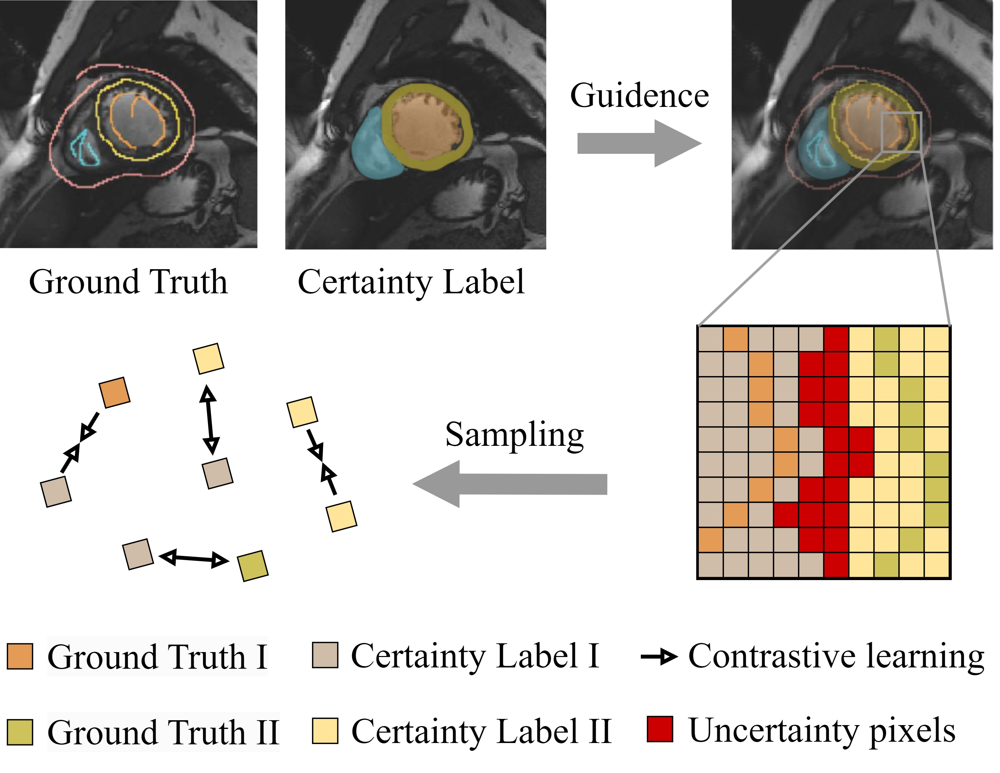
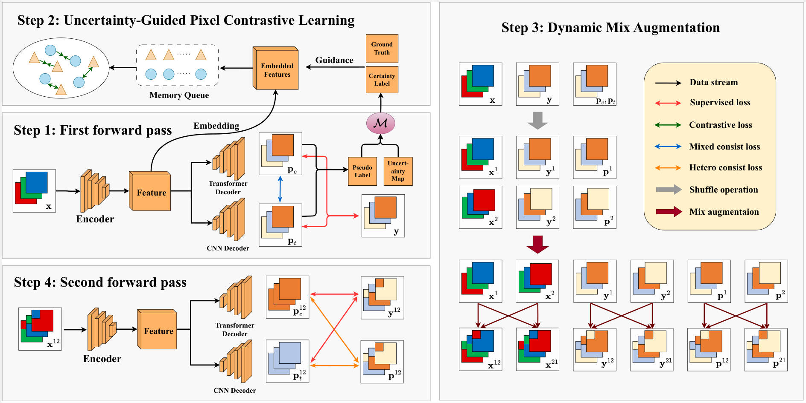
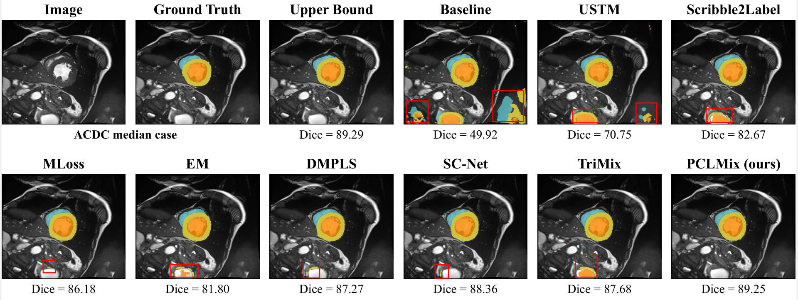

# PCLMix: Weakly Supervised Medical Image Segmentation via Pixel-Level Contrastive Learning and Dynamic Mix Augmentation

Pytorch implementation of our PCLMix (Weakly Supervised Medical Image Segmentation via Pixel-Level Contrastive Learning and Dynamic Mix Augmentation). 

## News
Congratulations! This work has been accepted by ICIC2024. Due to space limitations, this final submitted document represents an abridged version. The full version of this paper, including more detailed information and data, can be accessed at https://arxiv.org/abs/2405.06288.

## Core idea



## Overview of PCLMix



## Visual result



## Dataset

- The ACDC dataset with mask annotations can be downloaded from: [ACDC](https://www.creatis.insa-lyon.fr/Challenge/acdc/databases.html).
- The Scribble annotations of ACDC can be downloaded from: [Scribble](https://gvalvano.github.io/wss-multiscale-adversarial-attention-gates/data).

## Usage

1. Clone the project.
   
   ```bash
   git clone https://github.com/Torpedo2648/PCLMix.git
   ```

2. Train the model.
   
   ```bash
   python train_contrast.py --exp "PCLMix_contrast" --fold fold1 --contrast_weight 0.1 --het_weight 1.0 --unsup_m_weight 1.0 --tf_decoder_weight 0.4 --gpu 0
   python train_contrast.py --exp "PCLMix_contrast" --fold fold2 --contrast_weight 0.1 --het_weight 1.0 --unsup_m_weight 1.0 --tf_decoder_weight 0.4 --gpu 0
   python train_contrast.py --exp "PCLMix_contrast" --fold fold3 --contrast_weight 0.1 --het_weight 1.0 --unsup_m_weight 1.0 --tf_decoder_weight 0.4 --gpu 0
   python train_contrast.py --exp "PCLMix_contrast" --fold fold4 --contrast_weight 0.1 --het_weight 1.0 --unsup_m_weight 1.0 --tf_decoder_weight 0.4 --gpu 0
   python train_contrast.py --exp "PCLMix_contrast" --fold fold5 --contrast_weight 0.1 --het_weight 1.0 --unsup_m_weight 1.0 --tf_decoder_weight 0.4 --gpu 0
   ```

3. Test the model.
   
   ```bash
   python test_cnn.py --exp "PCLMix_contrast" --gpu 0
   ```
   
## Acknowledgement

The code is modified from [TriMix](https://github.com/MoriLabNU/TriMix), [WSL4MIS](https://github.com/HiLab-git/WSL4MIS) and [UGPCL](https://github.com/taovv/UGPCL).

## Citations

```latex
@inproceedings{Lei2024PCLMixWS,
  title={PCLMix: Weakly Supervised Medical Image Segmentation via Pixel-Level Contrastive Learning and Dynamic Mix Augmentation},
  author={Yu Lei and Haolun Luo and Lituan Wang and Zhenwei Zhang and Lei Zhang},
  year={2024},
  url={https://api.semanticscholar.org/CorpusID:269740819}
}
```
